# 🌬️ Series Học Tailwind CSS - Thiết kế UI hiện đại siêu tốc

- <b>Author: `@Vinhdev04`</b>  
  

> 💡 “Code nhanh, đẹp, chuẩn responsive với tiện ích cực mạnh từ Tailwind CSS”

---

## 📚 Giới thiệu

**Tailwind CSS** là framework utility-first CSS giúp bạn xây dựng giao diện web cực kỳ nhanh chóng chỉ bằng cách gắn class vào HTML.  
Series này sẽ giúp bạn:

- Nắm chắc cách sử dụng class tiện ích
- Hiểu tư duy thiết kế UI theo hệ thống
- Tự tin thiết kế các giao diện đẹp – responsive – tối ưu
- Xây dựng project thật bằng Tailwind

---

## 🧱 Cấu trúc Series

| STT | Chủ đề            | Nội dung                                       |
| --- | ----------------- | ---------------------------------------------- |
| 1️⃣  | Cài đặt Tailwind  | Cấu hình với Vite, Webpack, CDN                |
| 2️⃣  | Utility Classes   | Margin, Padding, Color, Font, Grid, Flex       |
| 3️⃣  | Responsive Design | Breakpoints, hover, focus, dark mode           |
| 4️⃣  | Component UI      | Card, Button, Navbar, Modal, Grid Layout       |
| 5️⃣  | Plugin & Custom   | Tạo theme riêng, dùng plugin forms, typography |
| 6️⃣  | Project mini      | Website landing page giới thiệu sản phẩm       |
| 7️⃣  | Triển khai        | Xuất bản lên Vercel/Netlify                    |

---

## 🎯 Mục tiêu đạt được

- ✅ Thành thạo Tailwind class phổ biến
- ✅ Thiết kế UI đẹp, mobile-first
- ✅ Xây dựng project hoàn chỉnh
- ✅ Có nền tảng học tiếp Next.js + Tailwind

---

## 🖼️ Ví dụ hình ảnh

### Giao diện responsive card

---

## ⚙️ Yêu cầu trước khi học

- Biết HTML & CSS cơ bản
- Có tư duy bố cục UI đơn giản
- Biết VSCode + Live Server

---

## 🔥 Tips học nhanh Tailwind

- Dùng plugin Tailwind IntelliSense cho VSCode
- Tập trung vào class layout đầu tiên: `flex`, `grid`, `space`, `gap`
- Luyện code lại từ bản thiết kế Figma → HTML + Tailwind

---

## ⭐ **Đừng quên**: Nếu thấy hữu ích hãy ⭐ repo và chia sẻ nhé!

---

## 🎨 Dự án cuối khóa - Tailwind CSS

---

### 📌 Tên dự án: `Coffeestyle`

#### Dự án 01

- <b>`Link demo: ` </b><a>https://coffeestyle-template.webflow.io/</a>

---

### 🧱 Template Design

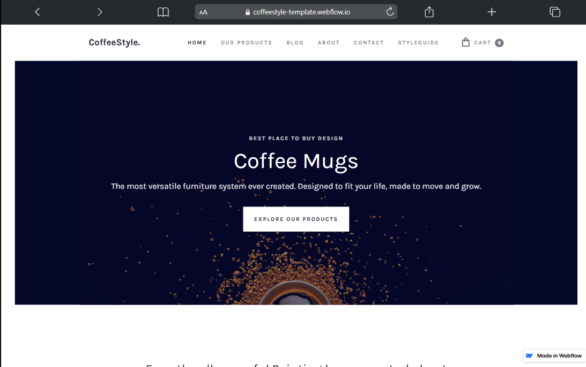
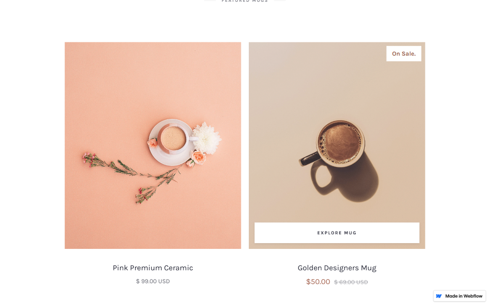
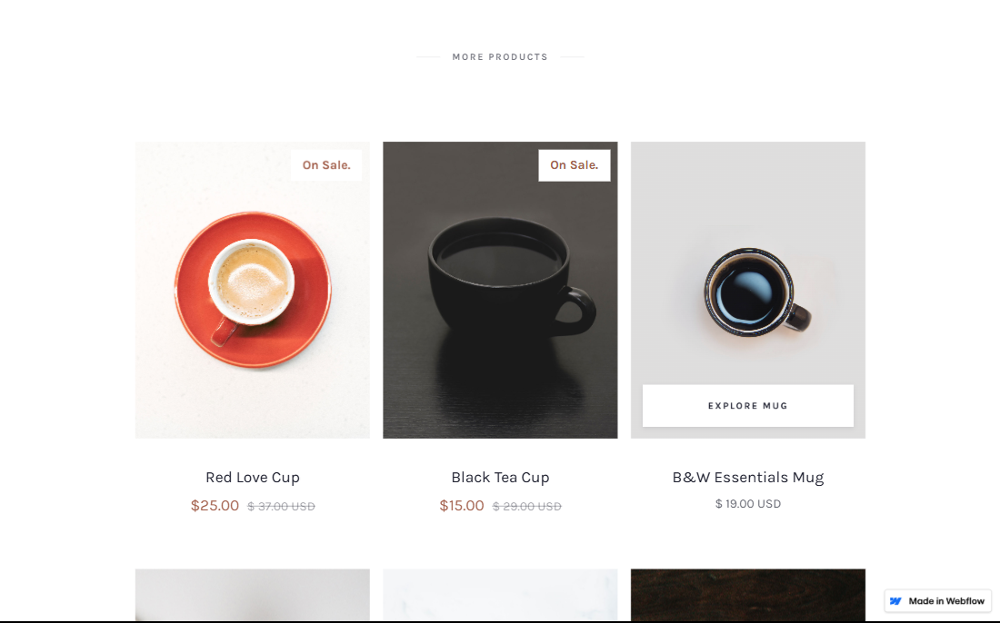

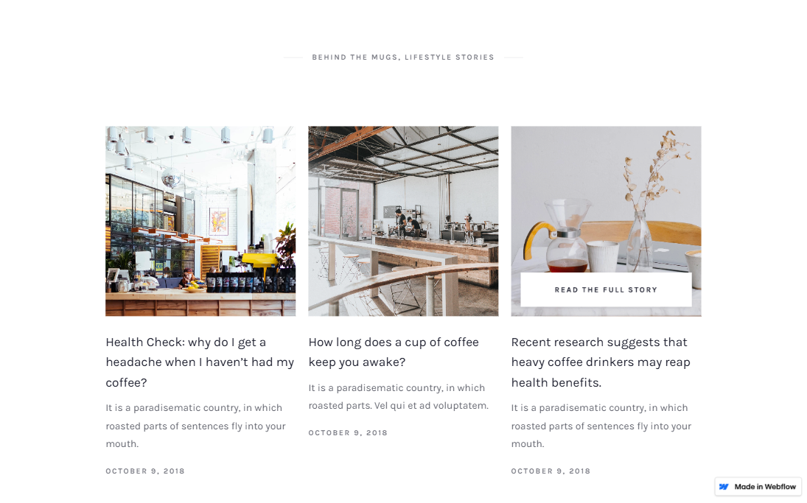
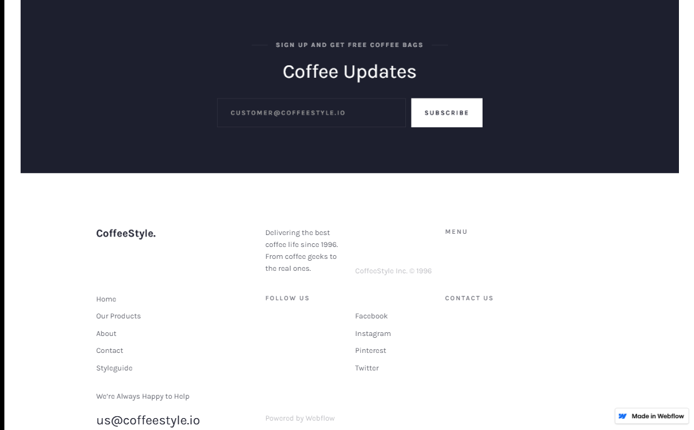
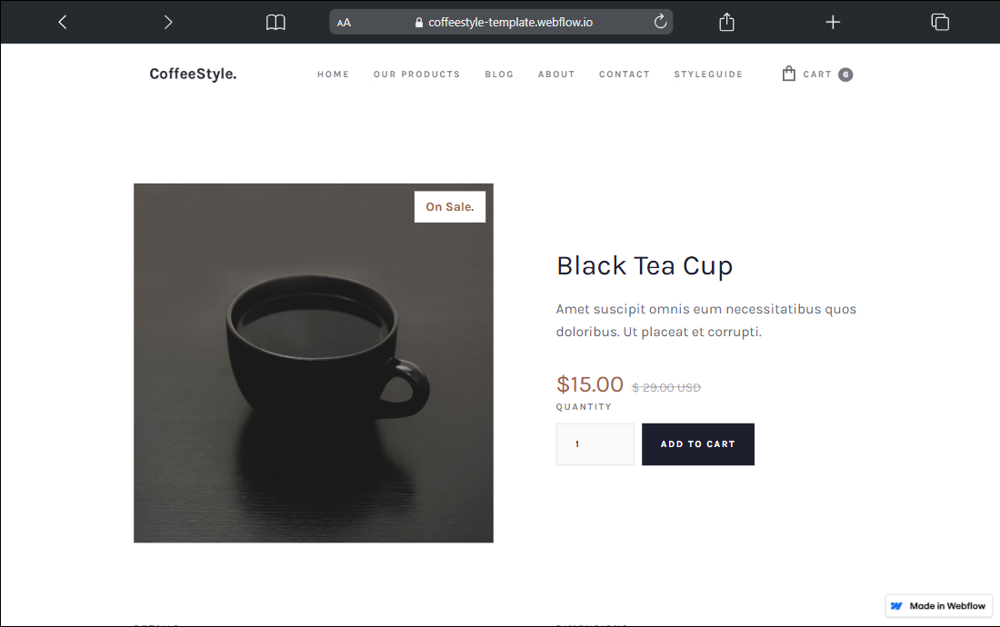

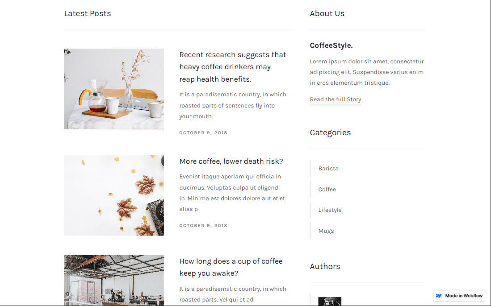

### 🖼️ Mục tiêu

- Thiết kế **giao diện website hiện đại**, responsive
- Sử dụng Tailwind CSS kết hợp với HTML/JS
- Bố cục rõ ràng, đẹp mắt, dùng nhiều class layout

---

---

### 💡 Gợi ý UI cần có

> 🎯 Ưu tiên thiết kế đẹp mắt, có thể clone từ Figma template hoặc Dribbble

---

### Taildwind Css

---

**Kiến thức cơ bản**

- <b> Phần 1: `Kiến thức cơ bản`</b>
- <i>Giới thiệu Tailwind CSS </i>
- <i>So sánh với Bootstrap 5 </i>
- <i>Làm quen với `utility classes` - nền tảng cốt lõi của TailWind </i>
- <i>Sử dụng `utility classes` </i>
- <b> Phần 2: `Làm dự án thực tế`</b>

---

**Tailwind CSS là gì?**

- <i>`Framework CSS` dựa trên `utility-first` (class nhỏ cho từng tính năng)</i>
- Khác với `Bootstrap`, `Tailwind` không có sẵn các thành phần như: `button, card, navbar,...` mà chỉ cung cấp các `class nhỏ` - gọi là `utility class` để tự tạo ra giao diện theo ý muốn
- <b>Tailwind: `https://tailwindcss.com`</b>

---

**Tailwind vs Bootstrap**

- <b>Bootstrap: `Component-based framework`</b>
- <i>Các `class` Bootstrap thừơng gói gọn rất nhiều thuộc tính CSS bên trong một class duy nhất để:</i>
- <i>Giảm code CSS tay</i>
- <i>Tạo giao diện quen thuộc, nhanh gọn</i>
- <i>Ko cần hiểu rõ CSS</i>
- <b>Tailwind: `utility-first`</b>
- <i>Kết hợp từng class nhỏ</i>
- <i>Tự do, linh hoạt</i>

---

**Ưu điểm của Tailwind**

- <b>`Lắp ghép giao diện từ các khối nhỏ, linh hoạt`</b>
- <b>`Sưa class->giao diện thay đổi ngay`</b>
- <b>`Không cần viết đi viết lại CSS,chỉ dùng class có sẵn`</b>
- <b>`Tăng tốc độ UI`</b>
- <b>`Không cần nghĩ tên class - class chính là tính năng`</b>
- <b>`Tốt cho làm việc nhóm,dự án lớn - không lo xung đột class`</b>

---

**Nhược điểm của Tailwind**

- <b>`Khó học hơn bootstrap do có nhiều class nhỏ lẻ`</b>
- <b>`Code dài do phải thêm class vào html`</b>

---

**Extension**

- <b>Taildwind CSS IntelliSense</b>
- <b>PostCSS Language Support</b>
- <b>Live Preview</b>

---

**Ôn tập Emmet**

- <i>`https://docs.emmet.io/cheat-sheet/`</i>
- <i>`Sibling: +` -> anh em liền kề nhau(và)</i>
- <i>`Climb-up: ^` -> ra ngoài 1 cấp </i>
- <i>`Grouping: ()` -> gom nhóm </i>
- <i>`Child: >` -> con trực tiếp </i>
- <i>`Multiplication: *` -> tạo với số lượng chi định </i>
- <i>`Item numbering: $` -> tạo với số lượng chi định tăng dần (kết hợp với \*) </i>
- <i>`[attribute]` -> truyền thuộc tính</i>
- <i>`{content}` -> truyền nội dung </i>
- Exam: `ul>li*5{item $}` 
  ` <ul>` 
  `     <li>item 1</li>` 
  `     <li>item 2</li>` 
  `     <li>item 3</li>` 
  `     <li>item 4</li>` 
  `     <li>item 5</li>` 
  `</ul>`  
- Exam: `ul>li*5[title=title$]` 
  ` <ul>` 
  `     <li title="title1"></li>` 
  `     <li title="title2"></li>` 
  `     <li title="title3"></li>` 
  `     <li title="title4"></li>` 
  `     <li title="title5"></li>` 
  `  </ul>` 

---

### Cài đặt Tailwind CSS

- <b>Sư dụng link CDN</b>
- <b>Sử dụng Tailwind CLI </b>
- <i>B1: `Run: npm install tailwindcss @tailwindcss/cli`</i>
- <i>B2: `Tạo folder src chứa file "input.css"`</i>
- <i>B2: `Thêm @import "tailwindcss"; vào input.css`</i>
- <i>B4: `Run: npx @tailwindcss/cli -i ./src/input.css -o ./src/output.css --watch` sẻ tạo ra file `output.css`</i>
- <b>Sử dụng Vite</b>
- <b>Sử dụng Using PostCSS</b>

---

### `Container` trong Tailwind CSS

- <i>Dùng để giới hạn chiêu rộng tối đa của phần tử</i>
- <i>Có thể tùy chinh theo ý</i>
- <i></i>
- 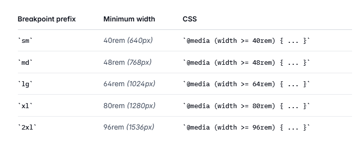

---

### `Color` trong Tailwind CSS

**Syntaxt:**

- <b>`prefix-color-shade`
- <i> `prefix: bg,shadow,text,decoration,border,...`</i>
- <i>`color: red,blue,green,...`</i>
- <i>`shade: 100,200,....`. Màu trắng và đen không có `shade`</i>
- <b>Custom Color: `text-[#name_color]`,`text-[rgb(name_color)],...`</b>  
- <i>`Code 01:` 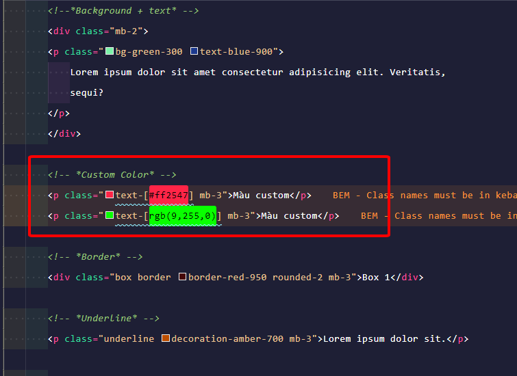</i>  
- <i>`Code 02:` 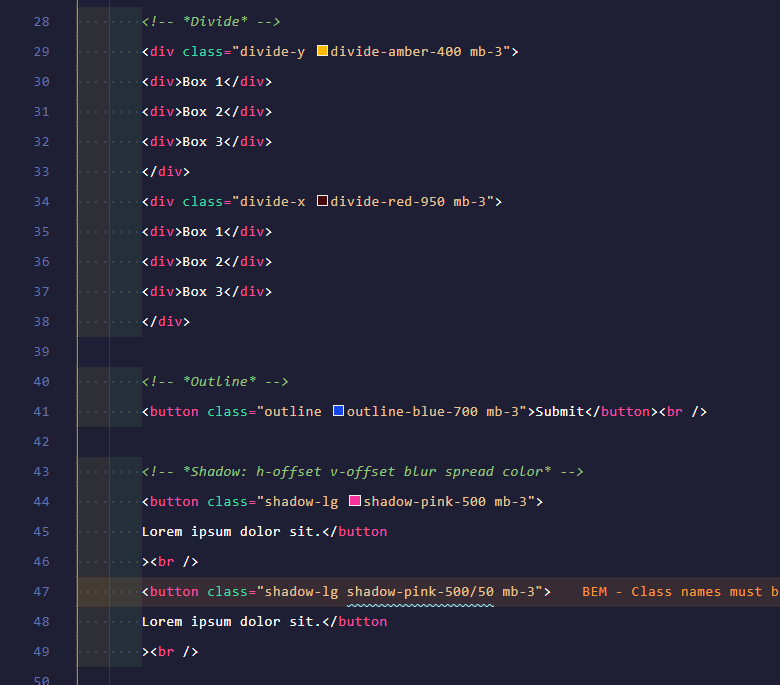</i>  
- <i>`Code 03:` </i>  
- <i>`Preview:` </i>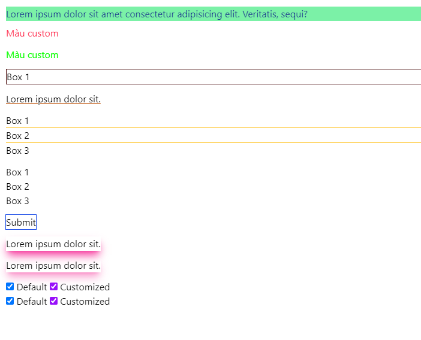</i>  

---

### `Margin & Padding` trong Tailwind CSS

**Syntaxt: `{property}{sides}-{size}`**

- <i>`property: m,p` <-> margin,padding</i>
- <i>`sides: t,b,s,e,x,y,blank` <-> top,bottom,start,end,horizontal,vertical, all 4 sides</i>
- <i>`sizes: 0,1 -> default: 1 `<-> 0.25rem, 1rem = 16px </i>
- <i>`auto` -> margin auto</i>
- <b>Có thể sử dụng giá trị tùy ý(px,em,rem,..): `mt-[20px]` -> margin-top: 20px</b>

**Sự khác biệt**

- <i>Không có `class` với `margin breakpoint`. Thay vào đó sử dụng hệ thống `breakpoint kết hợp với utility-class`</i>
  **Syntaxt: `<breakpoint>:<utility-class>`**
- <b>Ví dụ:</b>
- <i>`class="lg:m-4 md:m-2 sm:m-5"`</i>
- <i>`class="lg:bg-blue-50 md:bg-blue-200 "`</i>

---

### `Space-x & Space-y` trong Tailwind CSS

- <i>Dùng để tạo khoảng cách giữa phần tử con</i>
- <i>`space-x` <-> `margin-right`</i>
- <i>`space-y` <-> `margin-bottom`</i>
- <i>`space-x-reverse` <-> `margin-left`</i>
- <i>`space-y-reverse` <-> `margin-top`</i>

---

### `Sizing` trong Tailwind CSS

#### `width`:

- Thiết lập độ rộng cho phần tử
- `1 rem = 16px, 0.25rem = 4px`
- `1 spacing = 4px`

- 1.  `w-<number>` <=> `width: calc(var(--spacing) * number)`

  - Kích thước cố định
  - Ví dụ: w-20 <=> width: 20 \* 4 = 80px

- 2. `w-<fraction>` <=> `width: calc(<fraction> * 100%)`
  - Chiếm bao nhiêu phần trăm so với thẻ cha chứa nó
  - Ví dụ: w-1/2 <=> `width: 50%`
  - Ví dụ: w-1/3 <=> `width: 33.33%`
  - Chia theo phần nên ko linh hoạt nên sử dụng `w-[value];`
- 3. `width-3xs -> 7xl` <=> `width: calc(var(--container-3xs))`
- 4. `w-auto` <=> `width: auto`
- 5. `w-full` <=> `width: 100%`
  - Chiếm 100% chiều rộng thẻ cha
- 6. `w-screen` <=> `width: 100vw`
  - Chiếm 100% độ rộng khung nhìn (viewport width)
  - Hạn chế dùng với các giá trị cố định -> `vỡ giao diện do các giá trị cố định gây ra`
  - `Thẻ inline ko có tác dụng`
- 7. `w-dvw` <=> `width: 100dvw`
  - `dvw`: diagram viewport witdh
  - Dynamic tự động giữa lvw và svw
  - Ưu tiên sử dụng cho `mobile`
  - Dùng khi chiều rộng màn hình thay đổi do thanh cuộn,bàn phím ảo,....
- 8. `w-lvw` <=> `width: 100lvw`
  - `lvw`: large viewport witdh
  - Hiển thị lớn nhất có thể
  - Layout toàn màn hình, không bị co lại dù có thanh công cụ
- 9. `w-svw` <=> `width: 100svw`
  - `svw`: small viewport witdh
  - Hiển thị nhỏ nhất có thể
  - Layout toàn màn hình, bị co lại để tránh bị che khi hiện bàn phim/thanh địa chi,..
- 10. `Tùy chỉnh giá trị width`
  - Cú pháp: w-[value];
  - Ví dụ: w-[33%], w-[50px],..
- 11. `Width theo nội dung hoặc tự động`
  - `w-auto`:
    - Tự động, không bị set cứng giá trị width
  - `w-min`: Co nhỏ nhất theo từ có độ dài nhất có thể mà không vỡ nội dung
  - `w-max`: Mở rộng tối đa theo nội dung, khong bị rớt
  - `w-fit`: Tự điều chỉnh phù hợp với nội dung
  - `size(width,height)`: shorthand cho: width,height
    - Vi dụ: size-32 <=> width: 8rem,height: 8rem
  - `size-full,size-auto,size-px`
    - Vi dụ: `size-full` <=> width: 100%,height: 100% so với thẻ cha
    - Vi dụ: `size-px` <=> width: 1px,height: 1px
    - Vi dụ: `size-auto` <=> width: auto, height: auto do trinh duyệt quy định,` mặc định: inline-block`

---

#### `height`:

- Thiết lập chiều cao cho phần tử
- 1.  `h-<number>` <=> `height: calc(var(--spacing) * number)`

  - Kích thước cố định
  - Ví dụ: h-20 <=> height: 20 \* 4 = 80px

- 2. `h-<fraction>` <=> `height: calc(<fraction> * 100%)`
  - Chiếm bao nhiêu phần trăm so với thẻ cha chứa nó
  - Ví dụ: h-1/2 <=> `height: 50%`
  - Ví dụ: h-1/3 <=> `height: 33.33%`
  - Chia theo phần nên ko linh hoạt nên sử dụng `h-[value];`
- 3. `height-3xs -> 7xl` <=> `width: calc(var(--container-3xs))`
- 4. `h-auto` <=> `height: auto`
- 5. `h-full` <=> `height: 100%`
  - Chiếm 100% chiều rộng thẻ cha
- 6. `w-screen` <=> `height: 100vw`
  - Chiếm 100% chiều rộng khung nhìn (viewport height)
  - Hạn chế dùng với các giá trị cố định -> `vỡ giao diện do các giá trị cố định gây ra`
  - `Thẻ inline ko có tác dụng`
- 7. `w-dvh` <=> `height: 100dvh`
  - `dvwh: diagram viewport height
  - Dynamic tự động giữa lvh và svh
  - Ưu tiên sử dụng cho `mobile`
  - Dùng khi chiều rộng màn hình thay đổi do thanh cuộn,bàn phím ảo,....
- 8. `w-lvh` <=> `height: 100lvw`
  - `lvh`: large viewport height
  - Hiển thị lớn nhất có thể
  - Layout toàn màn hình, không bị co lại dù có thanh công cụ
- 9. `h-svh` <=> `height: 100svh`
  - `svh`: small viewport height
  - Hiển thị nhỏ nhất có thể
  - Layout toàn màn hình, bị co lại để tránh bị che khi hiện bàn phim/thanh địa chi,..
- 10. `Tùy chỉnh giá trị height`
  - Cú pháp: h-[value];
  - Ví dụ: h-[33%], w-[50px],..
- 11. `height theo nội dung hoặc tự động`
  - `h-auto`:
    - Tự động, không bị set cứng giá trị height
  - `h-min`: Co nhỏ nhất theo từ có độ dài nhất có thể mà không vỡ nội dung
  - `h-max`: Mở rộng tối đa theo nội dung, khong bị rớt
  - `h-fit`: Tự điều chỉnh phù hợp với nội dung
  - `size(width,height)`: shorthand cho: width,height
    - Vi dụ: size-32 <=> height: 8rem,height: 8rem
  - `size-full,size-auto,size-px`
    - Vi dụ: `size-full` <=> height: 100%,height: 100% so với thẻ cha
    - Vi dụ: `size-px` <=> height: 1px,height: 1px
    - Vi dụ: `size-auto` <=> height: auto, height: auto do trinh duyệt quy định,` mặc định: inline-block`

#### `min-width`:

- set kích thước tối thiểu cho phân tử
- Kể cả trinh duyệt co lại thì phần tư vân luôn ở kích thước min, không bị co lại thêm

#### `max-width`:

- set kích thước tối đa cho phân tử
- Kể cả trinh duyệt có mở rộng thì phần tư vân luôn ở kích thước max, và nếu trinh duyệt co lại thì sẻ bi tác động

#### `min-height`:

- set kích thước chiều cao tối thiểu cho phân tử

#### `max-height`:

- set kích thước chiều cao tối đa cho phân tử

---

### `Tailwind config (v3.4.17)` từ version 4 đã bỏ

#### Cách 1: Thêm thủ công vào version 4 sau khi cài CLI

- Cài tailwind CLI
- Tạo file tailwind.config.js và cấu hình mở rộng `extend`
- Trong file `input.css` trỏ file khai báo config, liên kết đường dẫn đến file config: `@config "../tailwind.config.js`
  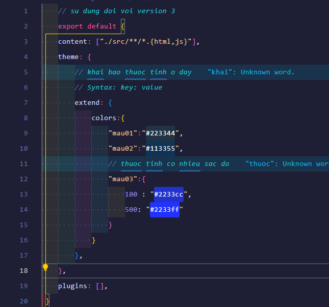

#### Cách 2:

- Thêm cấu hình mở rộng `extend` vào trong file `input.css`
  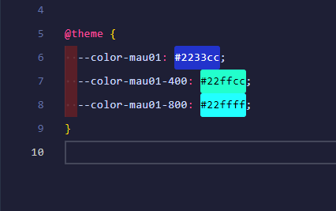

---

### `POSITIONING` trong Tailwind CSS